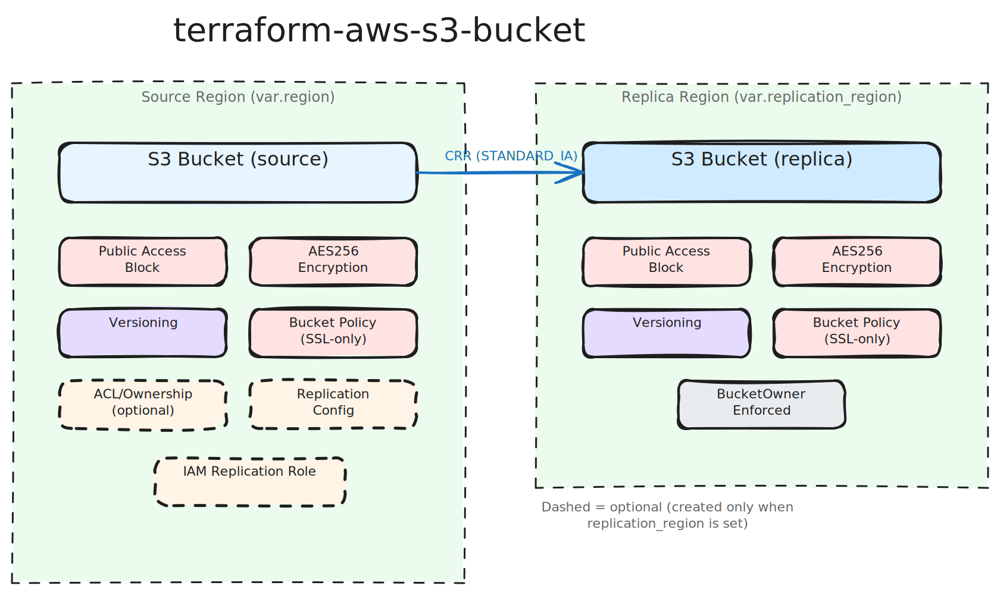

# terraform-aws-s3-bucket

[](https://infrahouse.com/contact)
[](https://infrahouse.github.io/terraform-aws-s3-bucket/)
[](https://registry.terraform.io/modules/infrahouse/s3-bucket/aws/latest)
[](https://github.com/infrahouse/terraform-aws-s3-bucket/releases/latest)
[](https://aws.amazon.com/s3/)
[](https://github.com/infrahouse/terraform-aws-s3-bucket/actions/workflows/vuln-scanner-pr.yml)
[](LICENSE)

A Terraform module for creating secure S3 buckets with sensible defaults.
The module enforces encryption, SSL-only access, and blocks public access
by default.

## Why This Module?

Creating an S3 bucket in AWS is easy. Creating one that meets ISO 27001
and SOC 2 requirements out of the box is not. This module encodes
InfraHouse's security opinions so every bucket gets encryption at rest,
SSL-only access, public access blocking, and optional cross-region
replication — all with a single `module` block.

## Architecture



## Features

- AES256 encryption at rest enabled by default
- SSL-only access enforced via bucket policy
- Public access block with all four settings enabled
- ACL support disabled by default (can be enabled for logging use cases)
- Optional versioning support
- Optional cross-region replication (single variable opt-in)
- Configurable bucket policies merged with SSL enforcement

## Quick Start

Every bucket must either enable cross-region replication (`replication_region`)
or carry an explicit Vanta exemption. This ensures compliance with the
`aws-s3-cross-region-replication-enabled` Vanta test.

```hcl
module "foo" {
    source  = "registry.infrahouse.com/infrahouse/s3-bucket/aws"
    version = "0.8.0"

    bucket_name        = "foo-bucket"
    replication_region = "us-east-1"
}
```

### Without Replication (Vanta Exemption)

If replication is unnecessary for a bucket, provide an exemption reason:

```hcl
module "artifacts" {
    source  = "registry.infrahouse.com/infrahouse/s3-bucket/aws"
    version = "0.8.0"

    bucket_prefix = "build-artifacts"

    vanta_exemptions = {
        "aws-s3-cross-region-replication-enabled" = "Ephemeral build artifacts - no DR value"
    }
}
```

### CloudFront Logging Bucket

To create a bucket for CloudFront access logs, enable ACLs with `object_ownership = "BucketOwnerPreferred"`.
CloudFront uses bucket policies for permissions (not ACL-based permissions), so the ACL can remain `private`:

```hcl
# Bucket policy granting CloudFront permission to write logs
data "aws_iam_policy_document" "cloudfront_logs" {
    statement {
        sid    = "AllowCloudFrontLogs"
        effect = "Allow"
        principals {
            type        = "Service"
            identifiers = ["cloudfront.amazonaws.com"]
        }
        actions   = ["s3:PutObject"]
        resources = ["${module.cloudfront_logs.bucket_arn}/*"]
    }
}

module "cloudfront_logs" {
    source  = "registry.infrahouse.com/infrahouse/s3-bucket/aws"
    version = "0.8.0"

    bucket_name      = "my-cloudfront-logs"
    enable_acl       = true
    acl              = "private"
    object_ownership = "BucketOwnerPreferred"
    bucket_policy    = data.aws_iam_policy_document.cloudfront_logs.json

    vanta_exemptions = {
        "aws-s3-cross-region-replication-enabled" = "Log bucket - replicated via log aggregation pipeline"
    }
}

# Use in CloudFront distribution
resource "aws_cloudfront_distribution" "example" {
    # ... other configuration ...

    logging_config {
        bucket = module.cloudfront_logs.bucket_domain_name
        prefix = "cloudfront/"
    }
}
```

### S3 Access Logging Bucket

To create a bucket for S3 access logs (S3-to-S3 logging), use the `log-delivery-write` ACL:

```hcl
module "s3_access_logs" {
    source  = "registry.infrahouse.com/infrahouse/s3-bucket/aws"
    version = "0.8.0"

    bucket_name      = "my-s3-access-logs"
    enable_acl       = true
    acl              = "log-delivery-write"
    object_ownership = "BucketOwnerPreferred"

    vanta_exemptions = {
        "aws-s3-cross-region-replication-enabled" = "Log bucket - replicated via log aggregation pipeline"
    }
}

# Use in another S3 bucket
resource "aws_s3_bucket_logging" "example" {
    bucket = aws_s3_bucket.example.id

    target_bucket = module.s3_access_logs.bucket_name
    target_prefix = "s3-logs/"
}
```

## Security

### Public Access Block

This module enforces AWS S3 public access block with all protections enabled:
- `block_public_acls = true`
- `block_public_policy = true`
- `ignore_public_acls = true`
- `restrict_public_buckets = true`

### ACL Support and Limitations

ACL support is **disabled by default** following AWS best practices. When you
need to enable ACLs (e.g., for CloudFront logging), the following canned ACLs
are supported:

**Safe to use:**
- `private` (default) - Owner gets full control, no one else has access (use for CloudFront logging)
- `log-delivery-write` - Log delivery group gets write and read permissions (use for S3 access logging)
- `aws-exec-read` - Owner gets full control, EC2 gets read access for AMI bundles
- `authenticated-read` - Owner gets full control, authenticated AWS users get read access

**Not allowed (blocked by validation):**
- `public-read` - Conflicts with public access block settings
- `public-read-write` - Conflicts with public access block settings

**Primary use case:** The ACL feature is designed for service logging scenarios
(CloudFront, ALB, etc.) where AWS services need to write logs to your bucket.
For most other access control needs, use bucket policies instead.

### Object Ownership

The module defaults to `object_ownership = "BucketOwnerPreferred"` for backward compatibility.

**Best Practice:** If you don't need ACLs (`enable_acl = false`), consider
explicitly setting `object_ownership = "BucketOwnerEnforced"` to follow AWS's
current best practices and fully disable ACLs:

```hcl
module "secure_bucket" {
    source  = "registry.infrahouse.com/infrahouse/s3-bucket/aws"
    version = "0.8.0"

    bucket_name      = "my-secure-bucket"
    object_ownership = "BucketOwnerEnforced"  # Fully disables ACLs (AWS best practice)
}
```

**Note:** `BucketOwnerEnforced` is incompatible with ACLs. If you need ACLs
for logging, use `BucketOwnerPreferred` or `ObjectWriter`.

### Encryption

All buckets are encrypted at rest using AES256 encryption by default.

For more usage examples, see how the module is used in the tests in `test_data/test_module`.

## Documentation

Full documentation is available on
[GitHub Pages](https://infrahouse.github.io/terraform-aws-s3-bucket/):

- [Getting Started](https://infrahouse.github.io/terraform-aws-s3-bucket/getting-started/)
- [Configuration Reference](https://infrahouse.github.io/terraform-aws-s3-bucket/configuration/)
- [Architecture](https://infrahouse.github.io/terraform-aws-s3-bucket/architecture/)
- [Examples](https://infrahouse.github.io/terraform-aws-s3-bucket/examples/)
- [Troubleshooting](https://infrahouse.github.io/terraform-aws-s3-bucket/troubleshooting/)

<!-- BEGIN_TF_DOCS -->

## Requirements

| Name | Version |
|------|---------|
| <a name="requirement_terraform"></a> [terraform](#requirement\_terraform) | ~> 1.9 |
| <a name="requirement_aws"></a> [aws](#requirement\_aws) | >= 6.0, < 7.0 |

## Providers

| Name | Version |
|------|---------|
| <a name="provider_aws"></a> [aws](#provider\_aws) | >= 6.0, < 7.0 |

## Modules

No modules.

## Resources

| Name | Type |
|------|------|
| [aws_iam_role.replication](https://registry.terraform.io/providers/hashicorp/aws/latest/docs/resources/iam_role) | resource |
| [aws_iam_role_policy.replication](https://registry.terraform.io/providers/hashicorp/aws/latest/docs/resources/iam_role_policy) | resource |
| [aws_s3_bucket.replica](https://registry.terraform.io/providers/hashicorp/aws/latest/docs/resources/s3_bucket) | resource |
| [aws_s3_bucket.this](https://registry.terraform.io/providers/hashicorp/aws/latest/docs/resources/s3_bucket) | resource |
| [aws_s3_bucket_acl.this](https://registry.terraform.io/providers/hashicorp/aws/latest/docs/resources/s3_bucket_acl) | resource |
| [aws_s3_bucket_object_lock_configuration.replica](https://registry.terraform.io/providers/hashicorp/aws/latest/docs/resources/s3_bucket_object_lock_configuration) | resource |
| [aws_s3_bucket_object_lock_configuration.this](https://registry.terraform.io/providers/hashicorp/aws/latest/docs/resources/s3_bucket_object_lock_configuration) | resource |
| [aws_s3_bucket_ownership_controls.this](https://registry.terraform.io/providers/hashicorp/aws/latest/docs/resources/s3_bucket_ownership_controls) | resource |
| [aws_s3_bucket_policy.replica](https://registry.terraform.io/providers/hashicorp/aws/latest/docs/resources/s3_bucket_policy) | resource |
| [aws_s3_bucket_policy.this](https://registry.terraform.io/providers/hashicorp/aws/latest/docs/resources/s3_bucket_policy) | resource |
| [aws_s3_bucket_public_access_block.public_access](https://registry.terraform.io/providers/hashicorp/aws/latest/docs/resources/s3_bucket_public_access_block) | resource |
| [aws_s3_bucket_public_access_block.replica](https://registry.terraform.io/providers/hashicorp/aws/latest/docs/resources/s3_bucket_public_access_block) | resource |
| [aws_s3_bucket_replication_configuration.this](https://registry.terraform.io/providers/hashicorp/aws/latest/docs/resources/s3_bucket_replication_configuration) | resource |
| [aws_s3_bucket_server_side_encryption_configuration.default](https://registry.terraform.io/providers/hashicorp/aws/latest/docs/resources/s3_bucket_server_side_encryption_configuration) | resource |
| [aws_s3_bucket_server_side_encryption_configuration.replica](https://registry.terraform.io/providers/hashicorp/aws/latest/docs/resources/s3_bucket_server_side_encryption_configuration) | resource |
| [aws_s3_bucket_versioning.enabled](https://registry.terraform.io/providers/hashicorp/aws/latest/docs/resources/s3_bucket_versioning) | resource |
| [aws_s3_bucket_versioning.replica](https://registry.terraform.io/providers/hashicorp/aws/latest/docs/resources/s3_bucket_versioning) | resource |
| [aws_caller_identity.current](https://registry.terraform.io/providers/hashicorp/aws/latest/docs/data-sources/caller_identity) | data source |
| [aws_iam_policy_document.bucket_policy](https://registry.terraform.io/providers/hashicorp/aws/latest/docs/data-sources/iam_policy_document) | data source |
| [aws_iam_policy_document.deny_kms_encryption](https://registry.terraform.io/providers/hashicorp/aws/latest/docs/data-sources/iam_policy_document) | data source |
| [aws_iam_policy_document.enforce_ssl_policy](https://registry.terraform.io/providers/hashicorp/aws/latest/docs/data-sources/iam_policy_document) | data source |
| [aws_iam_policy_document.replica_ssl_policy](https://registry.terraform.io/providers/hashicorp/aws/latest/docs/data-sources/iam_policy_document) | data source |
| [aws_iam_policy_document.replication_assume_role](https://registry.terraform.io/providers/hashicorp/aws/latest/docs/data-sources/iam_policy_document) | data source |
| [aws_iam_policy_document.replication_policy](https://registry.terraform.io/providers/hashicorp/aws/latest/docs/data-sources/iam_policy_document) | data source |

## Inputs

| Name | Description | Type | Default | Required |
|------|-------------|------|---------|:--------:|
| <a name="input_acl"></a> [acl](#input\_acl) | Canned ACL to apply to the bucket (e.g., 'private', 'log-delivery-write') | `string` | `"private"` | no |
| <a name="input_bucket_name"></a> [bucket\_name](#input\_bucket\_name) | Name of the S3 bucket. If null, bucket\_prefix will be used.<br/>Either bucket\_name or bucket\_prefix is required. | `string` | `null` | no |
| <a name="input_bucket_policy"></a> [bucket\_policy](#input\_bucket\_policy) | JSON policy document for the S3 bucket | `string` | `""` | no |
| <a name="input_bucket_prefix"></a> [bucket\_prefix](#input\_bucket\_prefix) | Prefix for the S3 bucket name. Used when bucket\_name is null.<br/>Either bucket\_name or bucket\_prefix is required. | `string` | `null` | no |
| <a name="input_enable_acl"></a> [enable\_acl](#input\_enable\_acl) | Enable ACL for the S3 bucket (required for CloudFront logging) | `bool` | `false` | no |
| <a name="input_enable_versioning"></a> [enable\_versioning](#input\_enable\_versioning) | Enable versioning for the S3 bucket | `bool` | `false` | no |
| <a name="input_force_destroy"></a> [force\_destroy](#input\_force\_destroy) | Allow bucket to be destroyed even if it contains objects | `bool` | `false` | no |
| <a name="input_object_lock_default_retention"></a> [object\_lock\_default\_retention](#input\_object\_lock\_default\_retention) | Default retention applied to every new object version. When null, the<br/>Object Lock capability is enabled but no retention is enforced<br/>(capability-only). Requires object\_lock\_enabled = true.<br/>Specify exactly one of days or years. | <pre>object({<br/>    mode  = string # GOVERNANCE | COMPLIANCE<br/>    days  = optional(number)<br/>    years = optional(number)<br/>  })</pre> | `null` | no |
| <a name="input_object_lock_enabled"></a> [object\_lock\_enabled](#input\_object\_lock\_enabled) | Enable S3 Object Lock (WORM) on the bucket. Create-time only and<br/>permanent - it cannot be disabled later, and it forces versioning on.<br/>Enabling the capability alone does NOT make objects immutable; set<br/>object\_lock\_default\_retention to enforce retention. | `bool` | `false` | no |
| <a name="input_object_ownership"></a> [object\_ownership](#input\_object\_ownership) | Object ownership setting for the bucket | `string` | `"BucketOwnerPreferred"` | no |
| <a name="input_replication_region"></a> [replication\_region](#input\_replication\_region) | AWS region for the replica bucket.<br/>When null, no replication resources are created. | `string` | `null` | no |
| <a name="input_tags"></a> [tags](#input\_tags) | Tags to apply on S3 bucket | `map(string)` | `{}` | no |
| <a name="input_vanta_exemptions"></a> [vanta\_exemptions](#input\_vanta\_exemptions) | Map of Vanta test slugs to exemption reasons. Each entry causes a<br/>tag `vanta-exempt:<slug> = <reason>` to be applied to the bucket.<br/>The reconciler Lambda in terraform-aws-org-governance reads these<br/>tags and calls the Vanta per-test deactivation API.<br/><br/>Keys must be known Vanta test slugs (validated at plan time).<br/>Values must conform to AWS tag value constraints (<=256 chars,<br/>allowed character set). | `map(string)` | `{}` | no |

## Outputs

| Name | Description |
|------|-------------|
| <a name="output_bucket_arn"></a> [bucket\_arn](#output\_bucket\_arn) | The ARN of the S3 bucket |
| <a name="output_bucket_domain_name"></a> [bucket\_domain\_name](#output\_bucket\_domain\_name) | The bucket domain name (legacy global endpoint format: bucket-name.s3.amazonaws.com) |
| <a name="output_bucket_name"></a> [bucket\_name](#output\_bucket\_name) | The name of the S3 bucket |
| <a name="output_bucket_name_with_policy"></a> [bucket\_name\_with\_policy](#output\_bucket\_name\_with\_policy) | The bucket name, sourced from the bucket policy resource. Reference this<br/>(instead of bucket\_name) when you need the bucket policy to be attached<br/>before using the bucket - consuming it creates an implicit dependency on<br/>aws\_s3\_bucket\_policy.this. Avoids first-apply races such as enabling ALB<br/>access logging before the log-delivery policy exists. |
| <a name="output_bucket_regional_domain_name"></a> [bucket\_regional\_domain\_name](#output\_bucket\_regional\_domain\_name) | The bucket regional domain name (format: bucket-name.s3.region.amazonaws.com) |
| <a name="output_replica_bucket_arn"></a> [replica\_bucket\_arn](#output\_replica\_bucket\_arn) | ARN of the replica bucket,<br/>or null if replication disabled. |
| <a name="output_replica_bucket_name"></a> [replica\_bucket\_name](#output\_replica\_bucket\_name) | Name of the replica bucket,<br/>or null if replication disabled. |
<!-- END_TF_DOCS -->

## Examples

See the [examples](examples/) directory for working examples of various use cases.

## Contributing

Contributions are welcome! Please see [CONTRIBUTING.md](CONTRIBUTING.md) for guidelines.

## License

This project is licensed under the Apache 2.0 License - see the [LICENSE](LICENSE) file for details.
